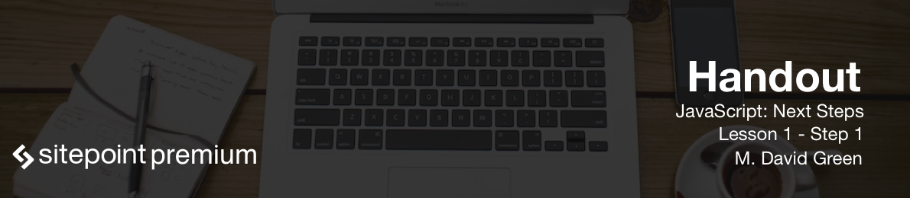

# Introduction

Hi, I'm M. David Green, and I'd like to welcome you to this course in Intermediate JavaScript!

This course is not going to be looking a lot at the frameworks, or different approaches that people have to using JavaScript in different contexts. This is a **core JavaScript programming course**, and what we're going to be looking at is some of the more intermediate topics in programming in JavaScript.

# What are we going to be covering?

One of the first things I'm going to be going over, is **regular expressions**. In regular expressions, we're going to be looking at concepts, such as testing and matching for strings, and also replacing and locating.

We're also going to be going deep into **closures**: how to form closures, and when to use them.

We'll be looking at objects and arrays, and how you can use them to form stacks in queues, and also how you can use JavaScript's **prototypes and classes**.

Finally, we're going to be showing how JavaScript goes beyond the typical looping iterations that you might be familiar with for more basic courses. We're going to be looking at `foreach`, `map` and `reduce` methods.

# Prerequisites for this course

* You should understand the fundamental syntax of JavaScript: how variables and types work.
* You should know the common operators and be comfortable reading simple statements.
* You want to understand how to use comments correctly, and how to recognize and avoid the use of reserved words.
* You'll need to understand how to declare variables, what `undefined` and `null` actually mean, what is a string, what is a number, what is a boolean, what are primitive types versus reference types.
* You should be familiar with the basics of how functions work in JavaScript. That includes knowing what a function is, what the arguments are, how scope works, what blocks are and what the keyword `this` means, and how it applies to functions. You should also understand how functions behave when they're passed.

If you'd like a refresher on any of that information, all of those topics are covered in detail in my "Introduction to JavaScript" course, also available from SitePoint Premium.

# What you need for the course

* One of the ways to practice for this course is to write scripts in HTML documents, and load them into a browser.
* Another place to practice is in the browser's developer tools.
* You can run JavaScript is in the terminal using Node.js, which is a JavaScript runtime built on Chrome's V8 JavaScript engine.
* The final place that I'd recommend working is in an online JavaScript Sandbox. The one that I'm going to be using for this class and for most of the examples is called JSBin, but there are others out there and you can choose the one that you prefer.